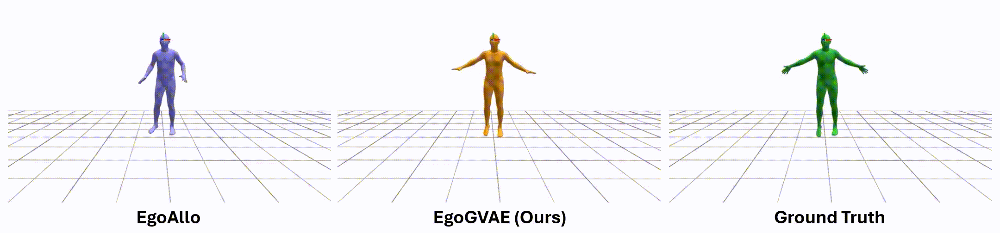
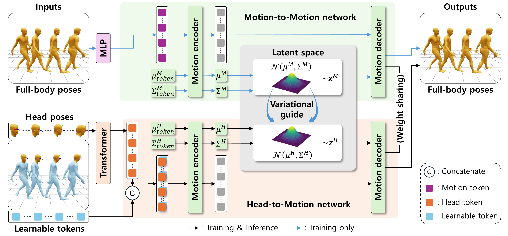

<h1 align="center">EgoGVAE: Ego-body Mesh Reconstruction via<br>Guided Variational Autoencoder</h1>


Official Pytorch implementation **"EgoGVAE: Ego-body Mesh Reconstruction via Guided Variational Autoencoder"** <br>
[Jaehun Jung](https://github.com/jaehun00) and [Wonjun Kim](https://sites.google.com/view/dcvl) (Corresponding Author) <br>
🏙️***European Conference on Computer Vision (ECCV)***, Sep. 2026.🏙️

<p align="center"></p>
<p align="center"></p>
<p align="center">[ Overall architecture ]</p>

## :eyes: Overview
We propose a simple yet powerful method, **EgoGVAE**, for full-body mesh reconstruction from only the head pose of the wearer.

**EgoGVAE** leverages the latent space of the motion-to-motion network, which is a variational autoencoder that takes full-body poses as inputs, to **guide the head-to-motion network**. <br>
This design scheme, which operates with one-step sampling in inference, makes **EgoGVAE perform very fast** compared to diffusion-based approaches.

We provide:

- ✅ **Full implementation** of EgoGVAE

## ✅ Full implementation
We provide an installation using Conda package and environment management:
### 🐍 Clone the repository
```bash
git clone https://github.com/brentyi/egoallo.git
```

### 📦 Install Dependencies
```bash
cd EgoGVAE_release
pip install -e .
```
